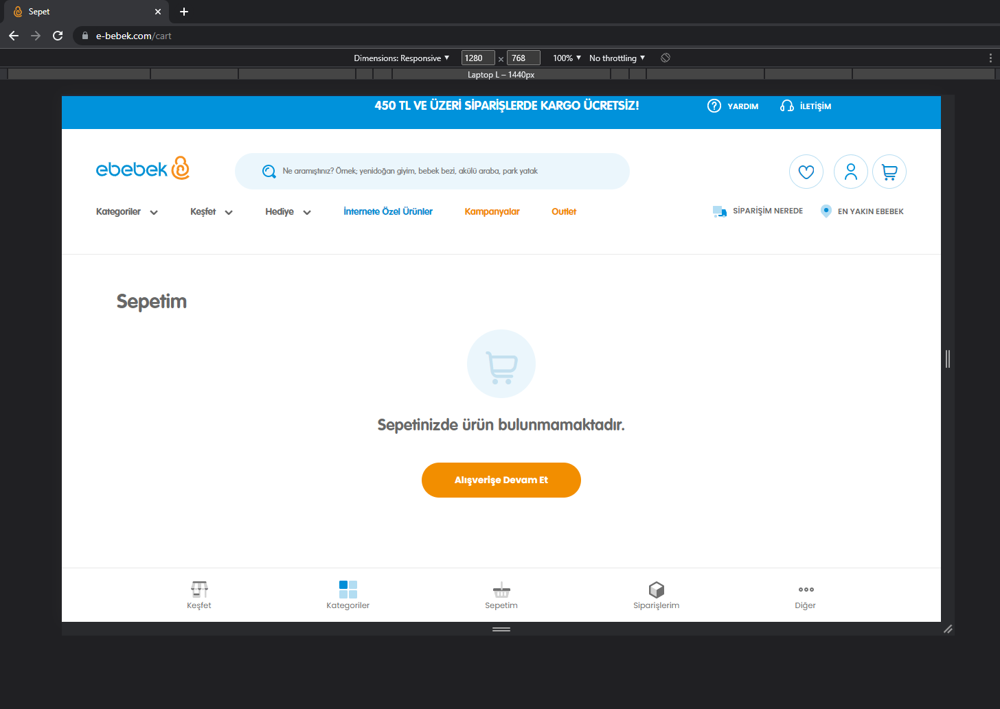
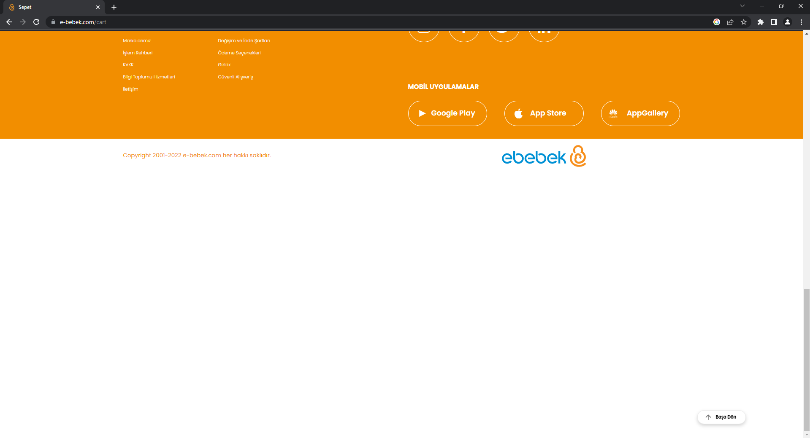

# ebebekJavaPracticum-QA-Homework

<!-- ABOUT THE PROJECT -->
## Project Description
This homework contains 4 different part. Aim of these exercises is to learn and practice basics of the Quality Assurance.

1. Manuel Test Scenarios
- Develop functional test cases for operations on the cart page
2. Test Automation (UI)
- Develop the following test scenario with Cucumber, Selenium and the programming language you want.
    1. The home page opens. (www.e-bebek.com)
    2. Type "bottle" in the search bar.
    3. The search is made.
    4. Click on the first product.
    5. Click the "Add to Cart" button.
    6. Click the "See Basket" button.
    7. Check that the product has been added to the cart.
4. Test Automation (API)
- Use the following test scenario to check the API Request Result(HTTP Status Code) using the programming language you want.
5. Error Reporting
- Scenario: Test scenario with “HTTP Status Code” 200 (successful), otherwise (failed) for one GET and POST request to be selected. (http://generator.swagger.io)

## Project Solutions

### Question 1

#### Manuel Test Scenario 1

Can we free cart after adding item to the cart ?

- First I added one item to my cart. 
- Then I go to check if I have an item in my cart. ( Yes I have it) 
- Added same time of item to my cart, I have same item of 5 in my cart.
- Deleted all items one by one and at the end i do not have any item in my cart.
- Test scenario passed successfully.

#### Manuel Test Scenario 2

If special character added to beginning of the search bar, Can we still find the item ?

- First I wrote "biberon" to the search bar. Results were as expected.
- I added special character at the beginning of the word. And repeated the search.
- I was expecting search to trim special characters from beginning of the word. 
- But I found out that actually with some special characters the search is working as expected.
- But with some characters search is not working as expected and showing different kind of items rather than "biberon".
- Test scenario passed partially :)

### Question 2

For this question Selenium used to achieve solution. This was the first time i used Selenium. However, it was fun to do test automation for ui.

You can find code here --> <a href="https://www.java.com/" target="_blank">Question 2 Code</a>

#### Question 2 - Output

### Question 3

For this question Rest Assured used to test api requests and responses.

You can find code here --> <a href="https://www.java.com/" target="_blank">Question 3 Code</a>

#### Question 3 - Output

### Question 4

1. Responsive UI Crashes with Tablet and Laptops(with small Screen Size)

1280x768 has tablet and phone menu at the bottom of the application. But Category Tab is not working. If you click on it, it is going to be selected but Categories are not showing on page.

2. Cart Page has blank white box at the bottom of the page.

When I open the https://www.e-bebek.com/ then when I want to go to my Cart as a Guest User. Unexpectedly, there is a white blank box at the bottom of the page.

<!-- TECHNOLOGIES -->
### Technologies

<!-- LICENSE -->
## License

Distributed under the MIT License. See `LICENSE.txt` for more information.

<!-- CONTACT -->
## Contact

### Mehmet Akif Tanisik

  

<!-- PROJECT-BOOTCAMP-PRACTICUM PART -->
 

## ebebek Java & QA & SAP Spartacus Practicum

  

<h3 align="center">Company: ebebek</h3>

 
  

  
<h3 align="center">Organizer: Patika.dev</h3>

